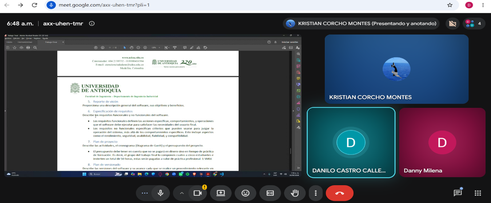

# Actas de Entendimiento y Compromiso

## Acta #1

**Fecha:** 2 de septiembre de 2026

La reunión inició a través de la plataforma Meet a las 7:45 a. m. Asistentes:

- Kristian Corcho
- Danilo Castro
- Danny Milena García
- Carlos Julio, manifestó excusa por calamidad.

La reunión se enfocó en la socialización del proyecto, comentarios y aportes de la participación de cada integrante. Cada participante creó su usuario en GitHub y se compartió el enlace del proyecto.

**Roles asignados:**

| Integrante | Rol |
|---|---|
| Kristian Corcho | Líder del equipo |
| Danny Milena García | Control de versiones |
| Danilo Castro | Control de interfaz |
| José Monsalve | Documentación |
| Carlos Julio | Revisión de documentación |

El trabajo se dividió según las fortalezas de cada participante; dado que no asistieron todos, se procedió a dividir solo entre los presentes, de acuerdo con los enunciados:

| Entregable | Responsable(s) |
|---|---|
| Integrantes | Todos los participantes |
| Vínculos académicos y descripción | Todos los participantes |
| Nombre del proyecto y detalles | Kristian Corcho |
| Licencia del software | Kristian Corcho |
| Reporte de visión | Danny Milena García |
| Especificación de requisitos | Danilo Castro |
| Plan de proyecto | Danny Milena García |

La reunión tuvo una duración aproximada de 1 hora y se finalizó programando el próximo encuentro para el 16 de septiembre a las 9:00 p. m., idealizando el cumplimiento de cada uno de los puntos por parte de los participantes.

