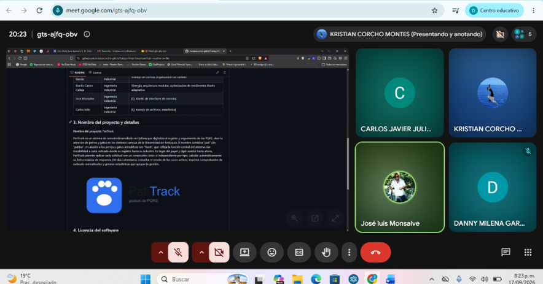

## Acta #2

**Fecha:** 17 de septiembre de 2026

La reunión inició a través de la plataforma Meet a las 8:10 p. m. Asistentes:

- Kristian Corcho
- Danny Milena García
- Carlos Javier Julio
- José Monsalve
- Danilo Castro, presentó problemas con la conexión (pero cumplió con la parte que le correspondía).

Se presentó una anomalía: José Monsalve decidió cancelar la materia, por lo cual las actividades de las cuales era responsable pasan a ser responsabilidad de todo el equipo.

Durante la reunión, cada encargado presentó sus puntos. Se resolvieron dudas, se hicieron mejoras en lo que hizo falta, se socializó y se revisó que todo estuviera correcto.

No se asignaron actividades nuevas, dado que el entregable es para el día siguiente. Se agenda reunión para el día 21 de septiembre en horas de la noche.

