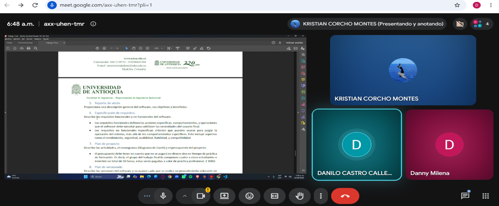
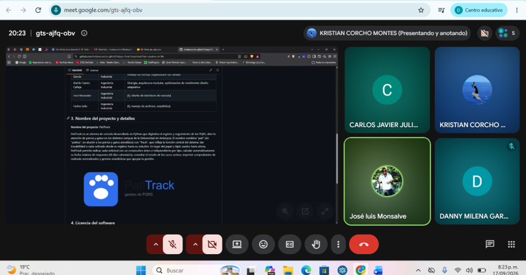
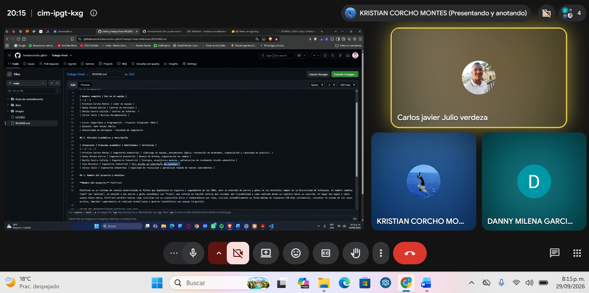

# Actas de Entendimiento y Compromiso

## Acta #1

**Fecha:** 2 de septiembre de 2026

La reunión inició a través de la plataforma Meet a las 7:45 a. m. Asistentes:

- Kristian Corcho
- Danilo Castro
- Danny Milena García
- Carlos Julio, manifestó excusa por calamidad.

La reunión se enfocó en la socialización del proyecto, comentarios y aportes de la participación de cada integrante. Cada participante creó su usuario en GitHub y se compartió el enlace del proyecto.

**Roles asignados:**

| Integrante | Rol |
| --- | --- |
| Kristian Corcho | Líder del equipo |
| Danny Milena García | Control de versiones |
| Danilo Castro | Control de interfaz |
| José Monsalve | Documentación |
| Carlos Julio | Revisión de documentación |

El trabajo se dividió según las fortalezas de cada participante; dado que no asistieron todos, se procedió a dividir solo entre los presentes, de acuerdo con los enunciados:

| Entregable | Responsable(s) |
| --- | --- |
| Integrantes | Todos los participantes |
| Vínculos académicos y descripción | Todos los participantes |
| Nombre del proyecto y detalles | Kristian Corcho |
| Licencia del software | Kristian Corcho |
| Reporte de visión | Danny Milena García |
| Especificación de requisitos | Danilo Castro |
| Plan de proyecto | Danny Milena García |

La reunión tuvo una duración aproximada de 1 hora y se finalizó programando el próximo encuentro para el 16 de septiembre a las 9:00 p. m., idealizando el cumplimiento de cada uno de los puntos por parte de los participantes.

---

## Acta #2

**Fecha:** 17 de septiembre de 2026

La reunión inició a través de la plataforma Meet a las 8:10 p. m. Asistentes:

- Kristian Corcho
- Danny Milena García
- Carlos Javier Julio
- José Monsalve
- Danilo Castro, presentó problemas con la conexión (pero cumplió con la parte que le correspondía).

Se presentó una anomalía: José Monsalve decidió cancelar la materia, por lo cual las actividades de las cuales era responsable pasan a ser responsabilidad de todo el equipo.

Durante la reunión, cada encargado presentó sus puntos. Se resolvieron dudas, se hicieron mejoras en lo que hizo falta, se socializó y se revisó que todo estuviera correcto.

No se asignaron actividades nuevas, dado que el entregable es para el día siguiente. Se agenda reunión para el día 21 de septiembre en horas de la noche.

---

## Acta #3

**Fecha:** 29 de septiembre de 2026

La reunión inició a través de la plataforma Meet a las 8:00 p. m. Asistentes:

- Kristian Corcho
- Danny Milena García
- Carlos Javier Julio

Durante la reunión se trabajó en el plan de versionado y en la creación del Colab. En el transcurso de la semana se compartirían, a través del grupo de WhatsApp, los datos e información para anexar al trabajo.

El encuentro duró aproximadamente una hora.

