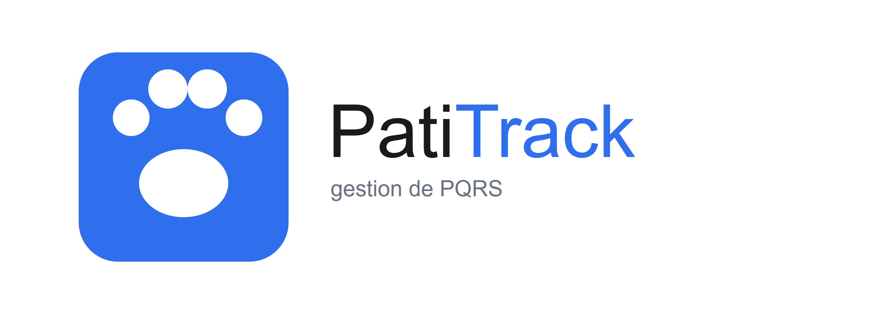

# PatiTrack — Gestor de PQRS

---

## 1. Integrantes

| Nombre completo | Rol en el equipo |
|---|---|
| Kristian Corcho Montes | Lider de equipo |
| Danny Milena Garcia | Control de Versiones |  
| Danilo Castro Calleja | Control de Interfaz  |
| Jose Monsalve | Documentacion |
| Carlos Julio | Revison Documentacion |

> Curso: Algoritmia y Programación — Proyecto Integrador 2026-2
> Docente: John Heider Dávila
> Universidad de Antioquia — Facultad de Ingeniería

## 2. Vínculos académicos y descripción

| Integrante | Programa académico | Habilidades / fortalezas |
|---|---|---|
| Kristian Corcho Montes | Ingenieria Industrial | liderazgo de equipo, pensamiento lógico, resolución de problemas, organización y capacidad de análisis. |
| Danny Milena Garcia | Ingenieria Industrial | Manejo de GitHub, organización de cambio |
| Danilo Castro Calleja | Ingenieria Industrial | Sinergia, arquitecura modular, optimizacion de rendimento diseño adaptativo |
| Jose Monsalve | Ingenieria Industrial | [Ej: diseño de interfaces de consola] |
| Carlos Julio | Ingenieria Industrial | [Ej: manejo de archivos, estadística] |

## 3. Nombre del proyecto y detalles

**Nombre del proyecto:** PatiTrack

PatiTrack es un sistema de consola desarrollado en Python que digitaliza el registro y seguimiento de las PQRS, obre la atención de perros y gatos en los distintos campus de la Universidad de Antioquia. El nombre combina "pati" (de "patitas", en alusión a los perros y gatos atendidos) con "Track", que refleja la función central del sistema: dar trazabilidad a cada radicado desde su registro hasta su solución. En lugar del papel y lápiz usados hasta ahora, PatiTrack permite radicar cada solicitud con un consecutivo único e independiente por tipo, calcular automáticamente su fecha máxima de respuesta (30 días calendario), consultar el estado de los casos activos, imprimir comprobantes de radicado normalizados y generar estadísticas que apoyan la gestión.




## 4. Licencia del software

Este proyecto se distribuye bajo la licencia **Commons Atribución-CompartirIgual 4.0 Internacional (CC BY-SA 4.0)**.

Se eligió esta licencia porque el proyecto nace como un desarrollo académico de apoyo a una causa estudiantil y se busca que cualquier mejora futura, hecha por otros estudiantes o grupos, se mantenga igualmente abierta y disponible para la universidad.

Consulta el archivo [`LICENSE`](./LICENSE) para el texto completo.

---

## Estructura del repositorio

```
/
├── src/      # Código fuente Python (.py)
├── docs/     # Documentación y Manual de Usuario
├── images/   # Logo y diagramas
└── data/     # Peticion.txt, Queja.txt, Reclamo.txt, Sugerencia.txt
```

## Documentación adicional (Entrega 1)

- [Reporte de visión](docs/reporte_vision.md)
- [Especificación de requisitos](docs/especificacion_requisitos.md)
- [Plan de proyecto](docs/plan_proyecto.md)
