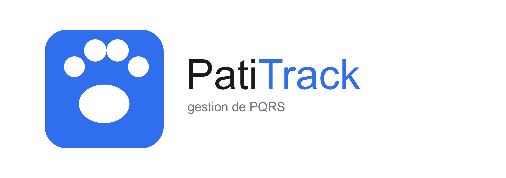

# PatiTrack — Gestor de PQRS

Sistema de consola en Python para el registro, consulta y seguimiento de Peticiones, Quejas, Reclamos y Sugerencias (PQRS) del Movimiento Estudiantil de Perritos y Gaticos (MEPEGA) de la Universidad de Antioquia. El programa gestiona la información mediante archivos planos, aplicando clases y objetos, y genera comprobantes de radicado y estadísticas de gestión.

---

## 1. Integrantes

| Nombre completo | Rol en el equipo |
|---|---|
| Kristian Corcho Montes | Líder de equipo |
| Danny Milena García Gonzales | Control de Versiones |
| Danilo Castro Calleja | Control de Interfaz |
| Carlos Javier Julio Verdeza | Revisión Documentación |

> Curso: Algoritmia y Programación — Proyecto Integrador 2026-2
> Docente: John Heider Dávila
> Universidad de Antioquia — Facultad de Ingeniería
>
> *José Monsalve participó en la Entrega 1 (documentación) y canceló la materia posteriormente, por lo cual no continúa en el equipo para la Entrega 2.*

## 2. Vínculos académicos y descripción

| Integrante | Programa académico | Semestre | Campus | Habilidades / fortalezas |
|---|---|---|---|---|
| Kristian Corcho Montes | Ingeniería Industrial | 6 | Seccional Bajo Cauca | Liderazgo de equipo, pensamiento lógico, resolución de problemas, organización y capacidad de análisis |
| Danny Milena García Gonzales | Ingeniería Industrial | [Semestre] | [Campus] | Manejo de GitHub, organización de cambios |
| Danilo Castro Calleja | Ingeniería Industrial | [Semestre] | [Campus] | Sinergia, arquitectura modular, optimización de rendimiento, diseño adaptativo |
| Carlos Javier Julio Verdeza | Ingeniería Industrial | 4  | Seccional Bajo Cauca | Capacidad de resolución y aprendizaje rápido de nuevos conocimientos |

## 3. Nombre del proyecto y detalles

**Nombre del proyecto:** PatiTrack

PatiTrack es un sistema de consola desarrollado en Python que digitaliza el registro y seguimiento de las PQRS (Peticiones, Quejas, Reclamos y Sugerencias) que recibe MEPEGA sobre la atención de perros y gatos en los distintos campus de la Universidad de Antioquia. El nombre combina "pati" (de "patitas", en alusión a los perros y gatos atendidos) con "Track", que refleja la función central del sistema: dar trazabilidad a cada radicado desde su registro hasta su solución. En lugar del papel y lápiz usados hasta ahora, PatiTrack permite radicar cada solicitud con un consecutivo único e independiente por tipo, calcular automáticamente su fecha máxima de respuesta (30 días calendario), consultar el estado de los casos activos, imprimir comprobantes de radicado normalizados y generar estadísticas que apoyan la gestión de MEPEGA.



## 4. Licencia del software

Este proyecto se distribuye bajo la licencia **Creative Commons Atribución-CompartirIgual 4.0 Internacional (CC BY-SA 4.0)**.

Esta licencia permite que cualquier persona use, copie, modifique y distribuya PatiTrack, incluso con fines comerciales, siempre que:

- **Atribución (BY):** se dé el crédito correspondiente al equipo desarrollador y a MEPEGA/Universidad de Antioquia, indicando si se hicieron cambios.
- **CompartirIgual (SA):** cualquier versión modificada o derivada del software debe distribuirse bajo esta misma licencia (CC BY-SA 4.0), garantizando que el proyecto y sus futuras adaptaciones permanezcan abiertos para la comunidad universitaria.

Se eligió esta licencia porque el proyecto nace como un desarrollo académico de apoyo a una causa estudiantil (MEPEGA) y se busca que cualquier mejora futura, hecha por otros estudiantes o grupos, se mantenga igualmente abierta y disponible para la universidad.

Consulta el archivo [`LICENSE`](./LICENSE) para el texto completo.

---

## Estructura del repositorio

```
/
├── src/      # Código fuente Python (.py)
├── docs/     # Documentación y Manual de Usuario
├── images/   # Logo y diagramas
└── data/     # Peticion.txt, Queja.txt, Reclamo.txt, Sugerencia.txt
```

## Documentación adicional (Entrega 1)

- [Reporte de visión](docs/reporte_vision.md)
- [Especificación de requisitos](docs/especificacion_requisitos.md)
- [Plan de proyecto](docs/plan_proyecto.md)
