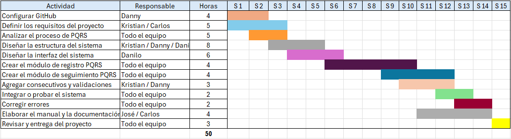

# Plan de Proyecto

## Actividades

| # | Actividad | Descripción | Responsable(s) | Horas | Semanas |
|---|---|---|---|---|---|
| 1 | Configurar GitHub | Crear el repositorio del proyecto, definir la estructura de carpetas (`src`, `docs`, `images`, `data`) y vincular a los integrantes del equipo. | Danny | 4 | S1–S2 |
| 2 | Definir los requisitos del proyecto | Entrevistar al docente (rol de Product Owner) y documentar los requisitos funcionales y no funcionales del sistema. | Kristian / Carlos | 5 | S1–S3 |
| 3 | Analizar el proceso de PQRS | Estudiar el proceso manual actual de MEPEGA para identificar los datos, validaciones y flujos que debe cubrir el sistema. | Todo el equipo | 5 | S2–S3 |
| 4 | Diseñar la estructura del sistema | Definir las clases (`c_Peticion`, `c_Queja`, `c_Reclamo`, `c_Sugerencia`) y la arquitectura modular (`validaciones.py`, `archivos.py`, `reportes.py`). | Kristian / Danny / Danilo | 8 | S3–S5 |
| 5 | Diseñar la interfaz del sistema | Diseñar el menú de consola y la experiencia de interacción del administrador con el sistema. | Danilo | 6 | S4–S6 |
| 6 | Crear el módulo de registro PQRS | Desarrollar el registro, la validación y el almacenamiento de nuevas PQRS en los archivos planos. | Todo el equipo | 4 | S6–S10 |
| 7 | Crear el módulo de seguimiento PQRS | Desarrollar la consulta de registros activos y el cambio de estado de las PQRS. | Todo el equipo | 4 | S9–S12 |
| 8 | Agregar consecutivos y validaciones | Implementar el autoincremento de ID por archivo y reforzar las validaciones de todos los campos. | Kristian / Danny | 3 | S10–S12 |
| 9 | Integrar o probar el sistema | Integrar los módulos desarrollados y realizar pruebas funcionales del programa completo. | Todo el equipo | 2 | S12–S13 |
| 10 | Corregir errores | Corregir los errores identificados durante las pruebas. | Todo el equipo | 2 | S13–S14 |
| 11 | Elaborar el manual y la documentación | Redactar el manual de usuario y completar la documentación del repositorio. | José / Carlos | 4 | S11–S14 |
| 12 | Revisar y entregar el proyecto | Revisión final del software y del repositorio antes de la entrega y sustentación. | Todo el equipo | 3 | S15 |
| | **Total** | | | **50** | |

## Cronograma (Diagrama de Gantt)

*(Captura de pantalla de `Gantt.xlsx`. Guarda la imagen como `gantt_patitrack.png` dentro de la carpeta `images/` del repositorio para que se vea aquí.)*

Fechas clave según el cronograma oficial del curso (`Plan_de_Accion_ALyPr_2026-2`):

- **Entrega 1** (puntos 1–7): 18 de septiembre de 2026 (semana 7).
- **Entrega 2** (proyecto completo): 27 de noviembre de 2026 (semana 17).
- **Sustentación**: 2 y 4 de diciembre de 2026 (semana 18).

## Presupuesto

El proyecto no involucra pago monetario real: se valora como tiempo de práctica de formación, a razón de 1 SMLV. El equipo (5 estudiantes) invierte un total de **50 horas**, según el desglose de actividades anterior.

- SMLV 2026: $1.750.905 COP.
- Valor hora ordinaria (jornada de 42 h/semana, vigente desde el 15 de julio de 2026): $1.750.905 ÷ 210 ≈ **$8.338 COP/hora**.
- Valorización estimada del proyecto: 50 h × $8.338 ≈ **$416.900 COP** (valor de referencia, no un pago real).

| Fase | Horas | Valor hora | Subtotal |
|---|---|---|---|
| Configuración y análisis (act. 1–3) | 14 h | $8.338 | ≈ $116.732 |
| Diseño (act. 4–5) | 14 h | $8.338 | ≈ $116.732 |
| Desarrollo (act. 6–8) | 11 h | $8.338 | ≈ $91.718 |
| Cierre: pruebas, manual y entrega (act. 9–12) | 11 h | $8.338 | ≈ $91.718 |
| **Total** | **50 h** | | **≈ $416.900** |
